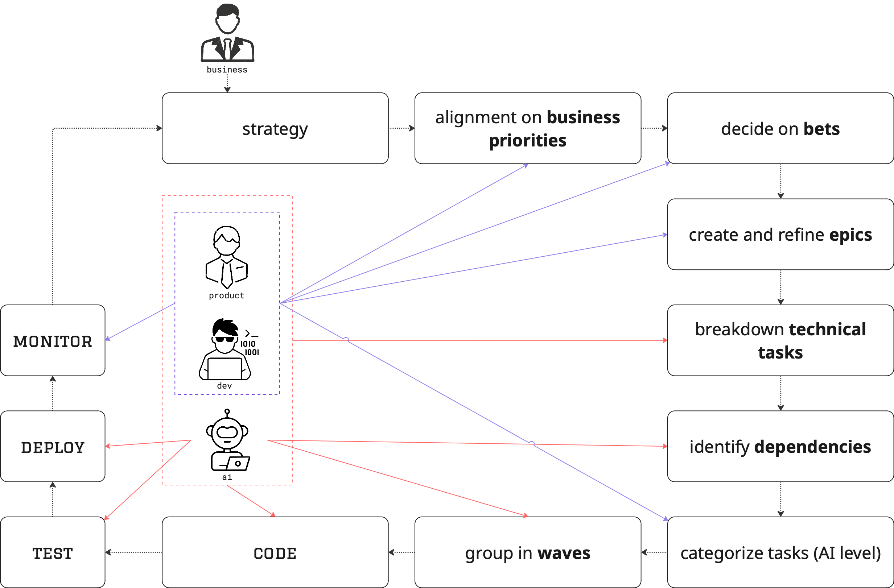

# Epics

### Epics = business capability containers

Epics represent coherent business capabilities composed of related tasks. They serve as the organizing principle for features and maintain the connection between technical implementation (waves) and business value.

Unlike traditional Scrum where work items often fragment business capabilities across multiple sprints, Hydro's epic integrity principle ensures complete business capabilities are delivered together within waves. This maintains the Product Operating Model's connection between product strategy and code execution and eliminates the handoff friction.

<figure><figcaption></figcaption></figure>

#### **Epic structure and organization**

Epics function as parent containers with specific organizational rules that can be implemented across different project management platforms:

* Clear labeling ( `[Epic]` identifier) to distinguish from regular tasks
* Hierarchical structure linking epics to their constituent tasks
* Epic status updates automatically when all contained tasks complete
* Project updates document epic progress and outcomes throughout wave execution

**Implementation examples**

* GitHub Projects: epic issues with task sub-issues
* Jira: Epic issue type with linked tasks
* Azure DevOps: features containing implementation tasks

This maintains the organizational principles while correctly reflecting that Hydro uses **tasks** (not stories) as the execution units, organized by **waves** (delivery) and **epics** (business capability).

#### **Epic integrity**

This fundamental rule ensures wave coherence and prevents execution fragmentation:

* All tasks within an epic must be in the same wave
* Epic wave field matches all contained tasks
* Epic completion occurs when all tasks in the wave complete
* Cross-epic waves are permitted, but epic tasks cannot split across waves

This creates a direct 1:1 or many:1 relationship - each epic belongs entirely to one wave, but waves can contain multiple epics or standalone tasks

**Epic-Wave relationship examples:**

Most waves contain complete epics, creating natural business capability boundaries:

```
Wave 2: User Management
├── Epic: User Registration (Tasks 3.1-3.5)
├── Epic: Profile Management (Tasks 4.1-4.3)
└── Standalone: Fix authentication edge case
```

Some waves focus on cleanup and discovered work:

```
Wave 5: Technical Debt Resolution
├── Fix: Database connection pooling issue
├── Optimize: Search query performance
└── Refactor: Legacy authentication code
```

***


Hydro Methodology © 2025 \
Licensed under Creative Commons Attribution 4.0 International (CC BY 4.0)

